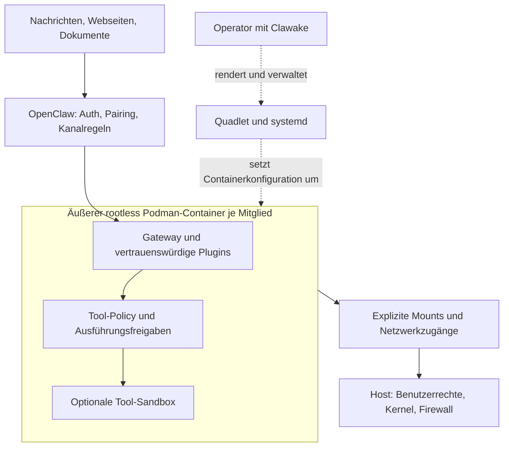

# Sicherheitsbewertung: Braucht OpenClaw die Clawake-Schicht?

Stand: 8. September 2026. Grundlage sind der Repository-Code, das persönliche
Inventar und die unten jeweils verlinkten Herstellerdokumentationen. Die
Die Pflegebetreuer-Runtime wurde am 7. September von 2026.8.2 auf 2026.9.2-browser aktualisiert.
Die Online-Dokumentation entwickelt sich weiter; ihre aktuellen Optionen sind kein
Nachweis über die wirksame Konfiguration einer konkreten Runtime. Dies ist eine
Architekturprüfung, kein Penetrationstest oder vollständiger Audit der laufenden
Instanzen.

## Entscheidung

**Clawake für dieses persönliche Team weiterführen, aber als schlanke Betriebs- und
Policy-Schicht mit messbarem Nutzen.** Mehrere persistente Gateways, Browserzugriff,
Plugins und persönliche Daten rechtfertigen eine zusätzliche Begrenzung auf
Container-Ebene. Ein per Digest festgelegtes Image und ein geprüftes Upgrade sind
auch unabhängig von Sicherheit nützlich.

Clawake ist dafür nicht technisch zwingend: Dieselben Containerregeln lassen sich
mit handgeschriebenen Quadlets umsetzen. Sein Mehrwert entsteht durch gemeinsame
Validierung, nachvollziehbare Änderungen, gezielte Mitgliedsoperationen und
überprüfbare Wiederherstellung. Nur YAML in drei Dateien umzuwandeln reicht als
langfristige Rechtfertigung nicht aus.

## Was OpenClaw selbst absichert

OpenClaw beschreibt einen Gateway als Vertrauensbereich eines Operators oder einer
gegenseitig vertrauenden Gruppe. Authentisierung, Pairing und Zugriffspolitiken
steuern den Zugang. Für gegeneinander abzusichernde Nutzer empfiehlt die
Dokumentation getrennte Gateways und möglichst getrennte Betriebssystemnutzer oder
Hosts. Daraus folgt: „OpenClaw ohne äußeren Container“ kann für einen begrenzten,
vertrauenswürdigen Einzelbetrieb eine angemessene Wahl sein; es ist keine allgemeine
Zusage sicherer Mehrmandantenfähigkeit.
[Quelle: OpenClaw-Sicherheitsmodell](https://docs.openclaw.ai/security).

Die optionale OpenClaw-Sandbox begrenzt Werkzeugausführung; laut aktueller
Dokumentation ist sie standardmäßig aus. Gateway und native Plugins liegen außerhalb
dieser Tool-Sandbox. In unserer Topologie bezeichnet der Gateway-Host aus Sicht von
OpenClaw den äußeren Container. Eine zusätzliche Tool-Sandbox darin wäre eine weitere
Ebene, die Clawake gegenwärtig nicht konfiguriert oder nachweist.
[Quelle: OpenClaw-Sandboxing](https://docs.openclaw.ai/gateway/sandboxing).

Tool-Policies legen fest, was erlaubt ist; eine Sandbox legt fest, wo die Ausführung
stattfindet. Eine Freigabe ersetzt keine Isolation. Für dieses Deployment müssen
beide Ebenen zusammenpassen, insbesondere bei Werkzeugen, die außerhalb der
Tool-Sandbox laufen dürfen.
[Quelle: Sandbox, Tool-Policy und Elevated](https://docs.openclaw.ai/gateway/sandbox-vs-tool-policy-vs-elevated).

## Onion-Modell: unabhängige Begrenzungen statt Zählen von Schichten

Die Darstellung ist ein Kontrollfluss: Plugin-Code erreicht nicht zwingend die
Tool-Policy oder Tool-Sandbox. Genau deshalb ist die äußere Containergrenze relevant.
Quadlet ist der deklarative Konfigurations- und Startmechanismus, keine eigene
Sandbox. Sicherheitswirkung haben die tatsächlich gesetzten Podman-/Kernel-Regeln.
Podman kann ohne Rootrechte betrieben werden und unterstützt deklarativen Betrieb
über Quadlet.
[Quelle: Podman](https://docs.podman.io/en/latest/markdown/podman.1.html).

| Ebene | Konkreter Nutzen | Verbleibende Grenze |
| --- | --- | --- |
| Kanalzugriff und Auth | Begrenzt, wer einen Agenten ansprechen darf | Erlaubte Nachrichten können schädlichen Inhalt enthalten |
| Werkzeugrechte und Freigaben | Begrenzt delegierte Aktionen | Erlaubte Werkzeuge bleiben mächtig; Plugins sind vertrauenswürdiger Code |
| Innere Tool-Sandbox | Begrenzt Prozesse und Dateien einzelner Werkzeugaufrufe | Gateway und native Plugins werden dadurch nicht eingekapselt |
| Äußerer Container | Schließt Gateway, Plugins und Werkzeuge in denselben beschränkten Dateisystem-/Prozessraum ein | Freigegebene Daten, Tokens und Netzverbindungen bleiben erreichbar |
| Rootless-Betrieb | Containerverwaltung benötigt keinen privilegierten Systemdienst | Derselbe Hostnutzer und Kernel bleiben gemeinsame Vertrauensbasis |
| Quadlet und Clawake | Machen Konfiguration und Betrieb wiederholbar und prüfbar | Fehlerhafte Regeln werden ebenfalls wiederholbar ausgerollt |
| Backup und Recovery | Können Auswirkungen eines Fehlers begrenzen | Verhindern weder Datenabfluss noch ungewollte Nachrichten |

## Konkrete Bedrohungen beim Pflegebetreuer

Die folgenden Aussagen sind unsere Bewertung des hiesigen Designs:

- **Manipulierte Nachricht oder Webseite:** Kann den Agenten zu unerwünschten
  Werkzeugaktionen bewegen. Enge Tool-Rechte und eine innere Sandbox begrenzen die
  Aktion; der äußere Container begrenzt zusätzlich den erreichbaren Hostbereich.
  Daten im freigegebenen Workspace bleiben angreifbar.
- **Fehlerhaftes oder kompromittiertes Plugin:** Läuft mit Gateway-Rechten. Der
  äußere Container schützt nicht eingebundene Hostpfade zusätzlich, schützt aber
  keine im Gateway verfügbaren Zugangsdaten vor diesem Plugin. OpenClaw fordert,
  Plugins als vertrauenswürdigen Code zu behandeln.
  [Quelle: Plugin-Sicherheit](https://docs.openclaw.ai/gateway/security).
- **Datenabfluss über WhatsApp oder Modellanbieter:** Kann vollständig innerhalb
  erlaubter Netzwerk- und Kontorechte stattfinden. Hier helfen Datenminimierung,
  Empfängerregeln und Freigaben; ein Container verhindert das nicht.
- **Fehler beim Update:** Image-Pin, Vorschau und Sicherung können die Änderung
  nachvollziehbar machen. Der gemeldete API-Konflikt ist ein solcher
  Kompatibilitätsfall, kein Beleg für einen abgewehrten Angriff.
- **Kompromittierter Hostnutzer oder Container-Ausbruch:** Mehrere rootless Container
  unter demselben Nutzer sind dafür keine hinreichend unabhängigen Vertrauensbereiche.
  Bei höherem Schutzbedarf getrennte Nutzer, Hosts oder VMs vorsehen.

## Was das Repository heute wirklich umsetzt

Geprüfte lokale Quellen: [Container-Template](../templates/quadlet/openclaw.container.j2),
[Netzwerk-Template](../templates/quadlet/openclaw.network.j2),
[Inventar](../personal-team/team.yml), [Validierung](../src/clawake/config.py),
[Gateway-Konfiguration](../src/clawake/services/gateway_config.py),
[Migrationscontainer](../src/clawake/services/runtime_upgrade.py) und
[Backup-Code](../src/clawake/services/backup.py).

| Befund | Bewertung |
| --- | --- |
| Je Mitglied ein Container, Workspace, Gateway-State und Netzwerk | Gute Basis zur Begrenzung versehentlicher Zugriffe; kein Nachweis vollständiger Netzwerkisolation |
| `UserNS=keep-id:uid=1000,gid=1000` | Bewusste Nutzerabbildung; keine eigene Hostidentität pro Mitglied |
| Teamdefinition `:ro`; Workspace und `.openclaw` schreibbar | Sinnvolle Trennung der Rollenvorgabe; Gateway-Konfiguration und Tokens liegen weiter in derselben Vertrauensgrenze |
| `.openclaw` liegt zusätzlich unter `/workspace` | Unsandboxierte Dateizugriffe können Laufzeitdaten auch über den Workspace erreichen |
| Persönliches Inventar veröffentlicht Ports auf `127.0.0.1` | Verringert direkte externe Erreichbarkeit; `bind: lan` innerhalb des Containers ist davon zu unterscheiden |
| Keine explizite Egress-Policy im Netzwerk-Template | Keine Zusage, dass fremde Dienste, Hostzugänge oder andere Mitglieder netzseitig unerreichbar sind |
| Keine expliziten Regeln für `NoNewPrivileges`, Capability-Drops, Read-only-Rootfs oder Ressourcenlimits | Effektive Host-/Podman-Defaults sind zu prüfen; Clawake liefert noch kein geprüftes Härtungsprofil |
| Zusätzliche Mounts sind frei konfigurierbar | Kein Verbot breiter Home-Mounts oder Runtime-Sockets; strukturelle Pfadvalidierung ist keine Zugriffspolitik |
| `allowInsecureAuth` wird für lokale HTTP-Bindings gegebenenfalls gesetzt | Bewusste Kompatibilitätseinstellung; bestehende Origins werden nur ergänzt, nicht bereinigt. Die Einstellung wird bei späterer Exposition nicht automatisch zurückgenommen |
| One-shot-Migration hat einen eigenen `podman run`-Pfad | Künftige Härtungsregeln müssen auch dort greifen, nicht nur in Quadlets |
| Backups können unlesbare Dateien überspringen | Upgrade-Erfolg beweist keine Wiederherstellbarkeit; Backup-Vollständigkeit muss verbindlich werden |

Das sind Codebefunde, keine Behauptung, alle möglichen Lücken seien auf dem laufenden
Host ausnutzbar. Secret-Inhalte und persönliche Gespräche wurden nicht ausgelesen.

## Welche Betriebsform passt?

| Szenario | Angemessene Wahl | Kosten und Nutzen |
| --- | --- | --- |
| Einzelner vertrauenswürdiger Nutzer, kleiner Funktionsumfang, eigener unkritischer Host | Native OpenClaw-Installation mit bewussten Policies und Updates kann genügen | Weniger Infrastruktur; Gateway und Plugins erhalten die Rechte des Dienstnutzers |
| Ein Gateway, wenige stabile Anforderungen | Manuell gepflegter rootless Container/Quadlet | Äußere Begrenzung ohne zusätzliche Clawake-Abhängigkeit |
| Mehrere langlebige Mitglieder, unterschiedliche Images, Plugins und Zustände | Clawake über rootless Podman/Quadlet | Weniger wiederholte Betriebsarbeit; sinnvoll, wenn Prüfungen und Recovery tatsächlich belastbar sind |
| Gegenseitig misstrauische Nutzer oder besonders sensible Datenbestände | Getrennte Sicherheitsdomänen, ggf. eigene Nutzer/VMs/Hosts | Mehr Aufwand, aber stärkere Trennung als Container unter einem gemeinsamen Nutzer |

Für das aktuelle persönliche Team spricht viel für die dritte Variante. Die
Pflege-/Familienrolle und externe Kommunikation erhöhen die Folgen eines Fehlers.
Das ist eine risikobasierte Architekturentscheidung, keine Compliance-Zertifizierung.

## Prioritäten für eine gerechtfertigte zusätzliche Schicht

1. **Kompatibilitätsprüfung vor Änderung:** Runtime, Plugin-API, Plugin-Version,
   Image-Variante und Digest gemeinsam prüfen; verständliche Abhilfe liefern.
2. **Verlässliche Recovery:** Unvollständige Sicherungen erkennen und vor Migration
   abbrechen; Restore-Probe und Wiederherstellung einzelner Mitglieder ermöglichen.
3. **Explizites, getestetes Härtungsprofil:** `NoNewPrivileges=true`, Capability-Drops,
   Ressourcenlimits und optional schreibgeschütztes Rootfs mit notwendigen
   Schreibpfaden prüfen. Podman dokumentiert diese Optionen, Clawake setzt sie
   derzeit nicht. Browser und Migrationen brauchen eigene Funktionstests.
   [Quelle: Quadlet-Optionen](https://docs.podman.io/en/latest/markdown/podman-systemd.unit.5.html).
4. **Mount-, Secret- und Netzwerkprüfung:** Runtime-Sockets und breite Hostpfade
   erkennen, effektive Exposition anzeigen, Gateway-State aus dem allgemeinen
   Arbeitsbereich trennen, innere Tool-Sandbox bewusst integrieren. Den Host-Docker-
   oder Podman-Socket dafür nicht einfach in den Gateway-Container durchreichen.
5. **Ein gemeinsamer Änderungsplan:** Quadlet-Inhalt, OpenClaw-Konfigurationsänderungen,
   Migrationscontainer und Neustarts sichtbar machen. Zusätzliche Sicherheitsoptionen
   dürfen keine nur im Template vorhandenen Versprechen bleiben.

Clawake sollte OpenClaws native Schutzmechanismen prüfen und ergänzen. Eine zweite
Pluginverwaltung oder bloß mehr Wrapper-Befehle würden die Wartung erhöhen, ohne
für sich genommen den Schutz zu verbessern.
