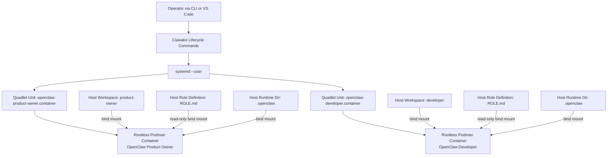

# User Journey: Clawake

## Platform Overview



Clawake treats each OpenClaw instance as an independent team member, encapsulated in a rootless container and managed by systemd user services through Quadlet.

## Starting Point

I use Clawake as a product stakeholder and evaluate it from an operational point of view. My mental model is team-oriented: each OpenClaw instance is one autonomous team member with a clearly defined role.

## Perspective and Responsibilities

- Developer: I operate Clawake through CLI commands and VS Code launch configurations.
- Customer: I evaluate whether the platform is viable for real product work.
- Stakeholder: I decide which team members we create, run, and secure.

## Operating Model

- Team member definitions are stored in staff files.
- Example definitions are located in examples/staff.
- Runtime operation definitions are located in staff.
- Day-to-day operation is handled through a small, explicit lifecycle command set.

## Phase 1 Journey: Lifecycle First

The initial milestone is to validate the core lifecycle flow end to end.

1. make install-dev
2. clawake setup-quadlets --config|-c <staff.yaml> (preview)
3. clawake setup-quadlets --config|-c <staff.yaml> --execute (mutation)
4. clawake restart-quadlets --config|-c <staff.yaml> (preview)
5. clawake restart-quadlets --config|-c <staff.yaml> [--member <name>] --execute (mutation)
6. clawake status-quadlets --config|-c <staff.yaml> [--format text|json]
7. clawake teardown-quadlets --config|-c <staff.yaml> [--member <name>] (preview)
8. clawake teardown-quadlets --config|-c <staff.yaml> [--member <name>] --execute (mutation)

### Goals of This Stage

- Measure how quickly a full team can be brought into service.
- Verify that lifecycle actions are executable without deep infrastructure knowledge.
- Surface security boundaries early, especially mounts, ports, and exposure scope.

## VS Code Trial Setup

For the first hands-on validation, use these launch configurations:

- Clawake: setup-quadlets
- Clawake: status-quadlets

Configuration baseline:

- examples/staff/team.yml

## Observation Log

### Round 1: Setup

- Expectation: Team members are provisioned as Quadlet units without requiring systemd internals.
- Observation: Dry-run previews all planned changes and applies only with --execute.
- Insight: The model is intuitive: team definition in, managed services out.
- Open question: Should setup output be grouped by role by default?

### Round 2: Restart

- Expectation: After config or image changes, only relevant members are restarted.
- Observation: Restart follows the same safety pattern: preview before mutation.
- Insight: Targeted restarts reduce risk and improve operational speed.
- Open question: Do we need an interactive confirmation for team-wide restarts?

### Round 3: Status

- Expectation: Status provides a compact, stakeholder-friendly view of team health.
- Observation: Each role is visible with runtime state and baseline checks.
- Insight: The health view works as the primary operational dashboard.
- Open question: Which status fields are mandatory in JSON output?

### Round 4: Teardown

- Expectation: Individual members or whole teams can be removed in a controlled way.
- Observation: Teardown is safe by default in preview mode and only mutates with --execute.
- Insight: Removal is a normal lifecycle operation, not an exceptional one.
- Open question: Should team-wide teardown always require a second confirmation?

## Security Check Per Round

- Risk: Unintended host mutation
- Impact: Instance outage or configuration drift
- Mitigation: Dry-run by default, explicit --execute, and targeted scope with --member

- Risk: Over-broad network exposure, for example 0.0.0.0
- Impact: Unwanted external reachability of team member instances
- Mitigation: Choose bind_address deliberately, prefer 127.0.0.1 for internal roles

- Risk: Over-broad write mounts into containers
- Impact: Host workspace or state tampering
- Mitigation: Restrict mounts to required paths, use read-only where practical

## Next Step

Capture real runtime outcomes for all lifecycle commands and derive concrete CLI improvements for output quality, selector logic, and guardrails.

# Onboarding a New Team Member

This section describes how to initialize a new OpenClaw team member and add it to an existing team.

## 1. Provide a Model for the Team Member

Each team member needs access to at least one language model.

Connect to the target container:

```bash
podman exec -it <team-member-container-name> /bin/bash
```

### List Available Models

```bash
openclaw models list --all
```

### Authenticate a Model Provider

If no provider is configured yet, authenticate one. Example for OpenAI:

```bash
openclaw models auth login --provider openai
```

Follow the interactive prompts. For native web search support, OpenClaw also recommends:

```bash
openclaw configure --section web
```

Recommended setting:

```text
Mode: cached
```

More information:

https://docs.openclaw.ai/tools/web

## 2. Define the Team Member Role

Each team member receives its identity, responsibilities, and working style from a ROLE.md file.

Role definitions are located under:

```text
/team-definition/
```

Examples:

```text
/team-definition/product_owner/ROLE.md
/team-definition/developer/ROLE.md
/team-definition/researcher/ROLE.md
```

A role definition should include:

- Purpose and ownership scope
- Working principles
- Decision authority
- Collaboration expectations with other team members

## 3. Onboard the Team Member

Start the OpenClaw TUI:

```bash
openclaw tui
```

At startup, the member is uninitialized and does not yet know its role.

Example:

```text
>> wake up my friend

Hey. I just came online.

Who am I, friend?
And who are you?
```

Then instruct it to load its role definition:

```text
Find your description in /team-definition/ROLE.md
```

The member reads the role definition and adopts the responsibilities defined there.

## 4. Ready for Work

After successful onboarding, the member knows:

- its role
- its responsibilities
- its working style
- its collaboration model with the rest of the team

The member is now operational and ready to execute role-specific tasks.
